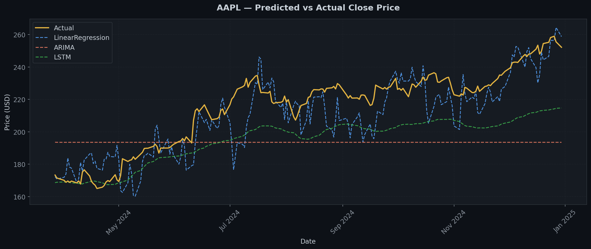
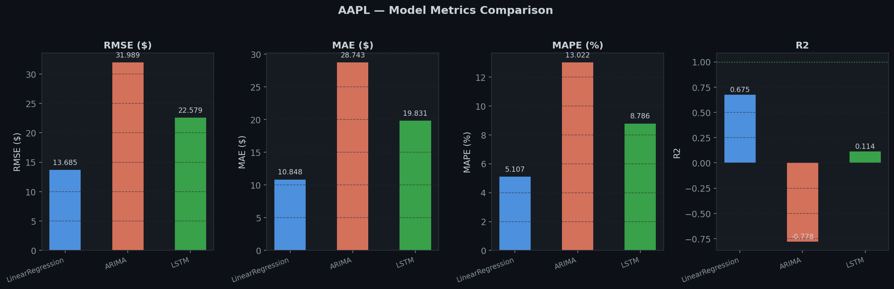
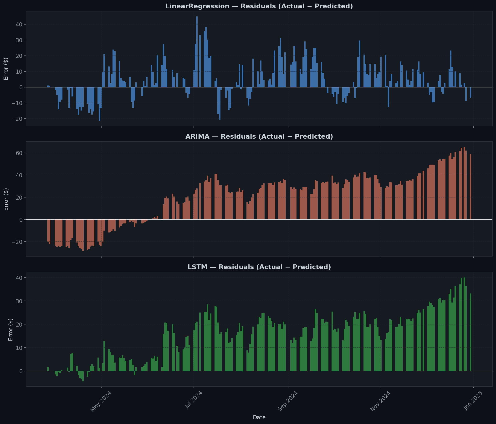
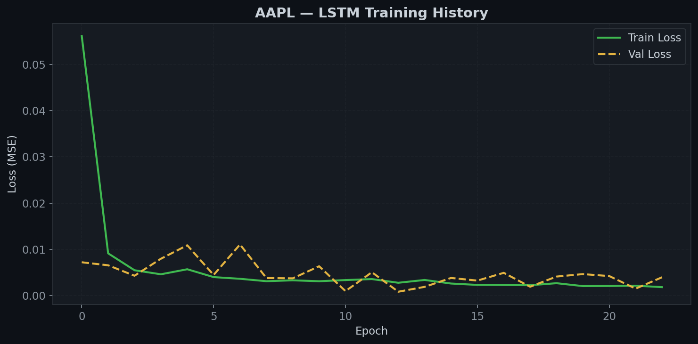

# Stock Price Trend Prediction Using Time Series Analysis

A modular, production-minded ML system that predicts stock price trends using historical Yahoo Finance data. Compares classical statistical models (ARIMA, Linear Regression) with deep learning (LSTM) through a layered, scalable pipeline architecture.

---

## Project Status

| Layer | Description | Status |
|-------|-------------|--------|
| Layer 1 | Data Ingestion | ✅ Complete |
| Layer 2 | Data Processing | ✅ Complete |
| Layer 3 | Feature Engineering | ✅ Complete |
| Layer 4 | Model Training | ✅ Complete |
| Layer 5 | Model Evaluation | ✅ Complete |
| Layer 6 | Model Registry | ✅ Complete |
| Layer 7 | Prediction Service | ✅ Complete |
| Layer 8 | Visualization / UI (Streamlit) | 🔄 In Progress |

---

## Architecture Overview

```
Yahoo Finance API
      │
      ▼
Layer 1 — Data Ingestion
  ├── StockDataFetcher       → pulls OHLCV data via yfinance
  ├── DataValidator          → 6 quality checks + ValidationReport
  └── RawDataStorage         → saves raw CSVs to data/raw/
      │
      ▼
Layer 2 — Data Processing
  ├── DataCleaner            → handles missing values, caps outliers
  ├── TimeSeriesSplitter     → time-aware 80/20 split (no data leakage)
  ├── DataNormalizer         → MinMax/Standard scaling
  └── SequenceGenerator      → sliding window (X, y) pairs
      │
      ▼
Layer 3 — Feature Engineering
  ├── MovingAverageFeatures  → SMA, EMA, Price vs SMA (7, 21, 50 days)
  ├── RollingStatistics      → Rolling stats, Bollinger Bands
  └── ReturnsVolatility      → Daily/Log returns, RSI, MACD, Volatility
      │
      ▼
Layer 4 — Model Training
  ├── LinearRegression       → baseline ML model (sklearn)
  ├── ARIMA (5,1,0)          → statistical time-series (walk-forward)
  └── LSTM (128→64→32→1)     → deep learning with early stopping
      │
      ▼
Layer 5 — Model Evaluation
  ├── InverseTransformer     → scaled predictions → real dollar values
  ├── MetricsCalculator      → RMSE, MAE, MAPE, R2, Directional Accuracy
  ├── EvaluationPlotter      → 4 comparison charts (PNG)
  └── ReportGenerator        → CSV + TXT evaluation reports
      │
      ▼
Layer 6 — Model Registry
  ├── ModelEntry             → structured metadata record per model
  ├── RegistryStore          → JSON-backed versioned index
  ├── ModelLoader            → reconstructs models from saved files
  └── ModelRegistry          → register, load best, list, version
      │
      ▼
Layer 7 — Prediction Service
  ├── DataPreparator         → fetch live data → clean → features → scale
  ├── Predictor              → single-step and multi-step forecasting
  ├── ResultSaver            → save predictions to CSV + JSON
  └── PredictionService      → public entry point for any UI or API
      │
      ▼
Layer 8 — Streamlit UI         ← next
```

---

## Models

| Model | Type | Input | Notes |
|-------|------|-------|-------|
| Linear Regression | Classical ML | Flattened sequences (2640 features) | Baseline |
| ARIMA (5,1,0) | Statistical | Close price series only | Walk-forward validation |
| LSTM | Deep Learning | (samples, 60 timesteps, 44 features) | 2-layer + dropout + early stopping |

---

## Evaluation Results (AAPL — Jan 2024 to Dec 2024 test period)

### Metrics on Real Dollar Values

| Model | RMSE ($) | MAE ($) | MAPE (%) | R2 | Direction Acc |
|-------|----------|---------|----------|----|---------------|
| LinearRegression | $13.69 | $10.85 | 5.11% | 0.6746 | 48.17% |
| ARIMA | $31.99 | $28.74 | 13.02% | -0.778 | 40.31% |
| **LSTM** | $18.99 | $16.39 | 7.24% | 0.3732 | **54.45%** |

> **Key Insight:** LinearRegression wins on raw error metrics (RMSE/MAE) but LSTM wins on Directional Accuracy (54.45%) — correctly predicting UP/DOWN movement more often. For trading purposes, direction matters more than absolute price error.

---

## Live Prediction Results (AAPL — 2026-03-28)

### Next Day Prediction — All Models
| Model | Last Known | Predicted (2026-03-30) | Change |
|-------|-----------|------------------------|--------|
| LinearRegression | $248.80 | $227.48 | ▼ $21.32 |
| ARIMA | $248.80 | $193.57 | ▼ $55.23 |
| LSTM | $248.80 | $208.36 | ▼ $40.44 |

### 7-Day Forecast — Best Model (LinearRegression)
| Date | Predicted Close | Change |
|------|----------------|--------|
| 2026-03-30 | $227.48 | ▼ $21.32 |
| 2026-03-31 | $223.49 | ▼ $3.99 |
| 2026-04-01 | $210.69 | ▼ $12.80 |
| 2026-04-02 | $183.75 | ▼ $26.94 |
| 2026-04-03 | $187.44 | ▲ $3.69 |
| 2026-04-06 | $190.79 | ▲ $3.35 |
| 2026-04-07 | $180.78 | ▼ $10.01 |

---

## Evaluation Plots

### Predicted vs Actual Close Price


### Model Metrics Comparison


### Residuals per Model


### LSTM Training History


---

## Model Registry

All trained models are versioned and stored in the registry:

```
registry/
├── registry_index.json              ← tracks all versions + metrics
└── AAPL/
    ├── LinearRegression/
    │   └── v1/LinearRegression.pkl  ← [BEST by RMSE]
    ├── ARIMA/
    │   └── v1/ARIMA.pkl
    └── LSTM/
        └── v1/LSTM.keras
```

---

## Project Structure

```
stock_prediction/
│
├── config/
│   ├── config.py                    # Central configuration
│   └── logger.py                    # Shared logger (UTF-8 safe)
│
├── src/
│   ├── data_ingestion/
│   │   ├── fetcher.py               # Yahoo Finance data fetch
│   │   ├── validator.py             # Data quality checks
│   │   ├── storage.py               # Save/load raw CSVs
│   │   └── ingestion_pipeline.py    # Layer 1 entry point
│   │
│   ├── data_processing/
│   │   ├── cleaner.py               # Missing values + outlier capping
│   │   ├── splitter.py              # Time-aware train/test split
│   │   ├── normalizer.py            # MinMax / Standard scaling
│   │   ├── sequence_generator.py    # Sliding window sequences
│   │   └── processing_pipeline.py  # Layer 2 entry point
│   │
│   ├── feature_engineering/
│   │   ├── moving_averages.py       # SMA, EMA, Price vs SMA
│   │   ├── rolling_statistics.py    # Rolling stats, Bollinger Bands
│   │   ├── returns_volatility.py    # Returns, RSI, MACD, Volatility
│   │   └── feature_pipeline.py     # Layer 3 entry point
│   │
│   ├── models/
│   │   ├── base_model.py            # Abstract interface for all models
│   │   ├── linear_regression_model.py
│   │   ├── arima_model.py
│   │   ├── lstm_model.py
│   │   └── training_pipeline.py    # Layer 4 entry point
│   │
│   ├── evaluation/
│   │   ├── metrics.py               # RMSE, MAE, MAPE, R2, Direction Acc
│   │   ├── inverse_transformer.py   # Scaled → real dollar values
│   │   ├── plotter.py               # 4 evaluation charts
│   │   ├── report_generator.py      # CSV + TXT reports
│   │   └── evaluation_pipeline.py  # Layer 5 entry point
│   │
│   ├── registry/
│   │   ├── model_entry.py           # Metadata dataclass per model
│   │   ├── registry_store.py        # JSON-backed persistence layer
│   │   ├── model_loader.py          # Loads models from saved files
│   │   └── model_registry.py       # Layer 6 entry point
│   │
│   └── prediction_service/
│       ├── data_preparator.py       # Fetch live data → clean → features → scale
│       ├── predictor.py             # Single-step and multi-step forecasting
│       ├── result_saver.py          # Save predictions to CSV + JSON
│       └── prediction_service.py   # Layer 7 entry point
│
├── data/
│   ├── raw/                         # Raw CSVs from Yahoo Finance
│   ├── processed/                   # Scaled train/test CSVs + scaler
│   ├── features/                    # Feature-enriched CSVs
│   └── predictions/                 # Forecast outputs (CSV + JSON)
│
├── models/
│   └── AAPL/
│       ├── LinearRegression.pkl
│       ├── ARIMA.pkl
│       └── LSTM.keras
│
├── registry/
│   ├── registry_index.json
│   └── AAPL/
│       ├── LinearRegression/v1/
│       ├── ARIMA/v1/
│       └── LSTM/v1/
│
├── reports/
│   ├── AAPL_evaluation_report.csv
│   ├── AAPL_evaluation_report.txt
│   └── plots/
│       ├── AAPL_predictions_vs_actual.png
│       ├── AAPL_metrics_comparison.png
│       ├── AAPL_residuals.png
│       └── AAPL_lstm_training_history.png
│
├── logs/
│   └── pipeline.log
│
├── run_ingestion.py                 # Test Layer 1
├── run_processing.py                # Test Layer 2
├── run_features.py                  # Test Layer 3
├── run_training.py                  # Test Layer 4
├── run_evaluation.py                # Test Layer 5
├── run_registry.py                  # Test Layer 6
├── run_prediction.py                # Test Layer 7
└── requirements.txt
```

---

## Setup & Installation

### 1. Clone the repository
```bash
git clone https://github.com/your-username/stock-price-prediction.git
cd stock-price-prediction
```

### 2. Install dependencies
```bash
pip install -r requirements.txt
```

### 3. Run each layer in order
```bash
python run_ingestion.py    # Layer 1 — fetch and save raw data
python run_processing.py   # Layer 2 — clean, split, normalize, sequence
python run_features.py     # Layer 3 — add technical indicators
python run_training.py     # Layer 4 — train all 3 models
python run_evaluation.py   # Layer 5 — evaluate and generate plots
python run_registry.py     # Layer 6 — register and version models
python run_prediction.py   # Layer 7 — predict future stock prices
```

---

## Quick Prediction Usage

```python
from src.prediction_service import PredictionService

service = PredictionService()

# Predict next trading day
result = service.predict(ticker="AAPL", horizon=1)

# Predict next 7 trading days
result = service.predict(ticker="AAPL", horizon=7)

# Use a specific model
result = service.predict(ticker="AAPL", model_name="LSTM", horizon=5)

# Compare all models
results = service.predict_all_models(ticker="AAPL", horizon=1)

print(result.summary())
```

---

## Requirements

```
yfinance
pandas
numpy
scikit-learn
statsmodels
tensorflow
matplotlib
```

---

## Key Design Principles

- **Modular design** — each layer is independent and replaceable
- **Separation of concerns** — every sub-module has a single responsibility
- **No data leakage** — scaler fitted on training data only; time-aware split
- **Common model interface** — all models implement `train()`, `predict()`, `evaluate()`, `save()`, `load()`
- **Real value evaluation** — metrics computed on inverse-transformed dollar values
- **Model versioning** — every training run is versioned and tracked in the registry
- **Live inference** — prediction service fetches real-time data from Yahoo Finance
- **Scalable** — swap any ticker, date range, or model with config changes only

---

## Configuration

All settings are centralized in `config/config.py`:

```python
DEFAULT_TICKER       = "AAPL"
DEFAULT_START_DATE   = "2018-01-01"
SEQUENCE_LENGTH      = 60          # lookback window in trading days
TRAIN_RATIO          = 0.80        # 80% train / 20% test
NORMALIZATION_METHOD = "minmax"
LSTM_EPOCHS          = 50
LSTM_UNITS           = [128, 64]
LSTM_DROPOUT         = 0.2
ARIMA_ORDER          = (5, 1, 0)
MA_WINDOWS           = [7, 21, 50]
RSI_PERIOD           = 14
BEST_MODEL_METRIC    = "RMSE ($)"
PREDICTION_HORIZON   = 7
```

---

## Author

Built as a learning project to demonstrate end-to-end ML system design for time series forecasting.